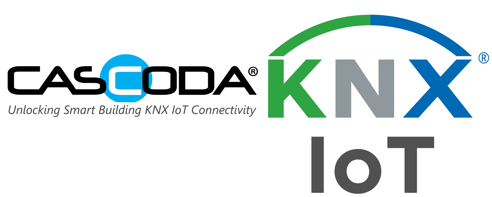

 
# KNX IoT Example

## Introduction

This repository hosts our latest version of the KNX IoT Development Board Demos, pre-built and ready to flash.

This repository also hosts source code for example applications, which can be built using provided scripts.

## KNX IoT Development Board Demos

The following KNX IoT Development Board Demos can be found in the releases page. [Click here](https://github.com/cascoda/knx_iot_example/releases/latest) for the latest release.

| Application  | Description |  Click/Hardware | Battery-power enabled |
|--------------| ------------| ----------------| --------------------- |
| CARGB | Colour Actuator RGB  | LED Driver 3 Click | N |
| RELAY  | Relay Actuator | RELAY Click | N |
| RTS | Room Temperature Sensor | Thermo 3 Click | Y |

In the zip file contained in the release, you will find a folder which contains the following:
- One ETS project to configure and interact with all three of the demos. _The password for this file is the letter "a"_.
- A folder for each of the demos, containing:
    - A PDF manual
    - An application binary
    - A QR code for Thread and KNX commissioning (note: this can also be found in the PDF manual)

## Example Applications with Source

| Application  | Description |  Functions | Click/Hardware | Bus | Virtual device |
|--------------| ------------| ---------- | ------| ----| -- |
| [Example](/EXAMPLE/readme.md) | Code of the Example   | LSAB LSSB | - | - | Y |
| [Battleship](/BATTLESHIP/readme.md)  | Code of battleship (the game) | Eink | - | - | N |

See the [video](https://www.youtube.com/watch?v=66mzvUYrxmc) of battleship being configured by ETS and being played.

ETS Test projects for those examples can be found in the folder input/[Application]/MT

## EINK display info

https://www.waveshare.com/1.54inch-e-paper-module.htm

- Description: 200x200, 1.54inch E-Ink display module
- SKU: 12955
- Part Number: 1.54inch e-Paper Module
- Brand: Waveshare